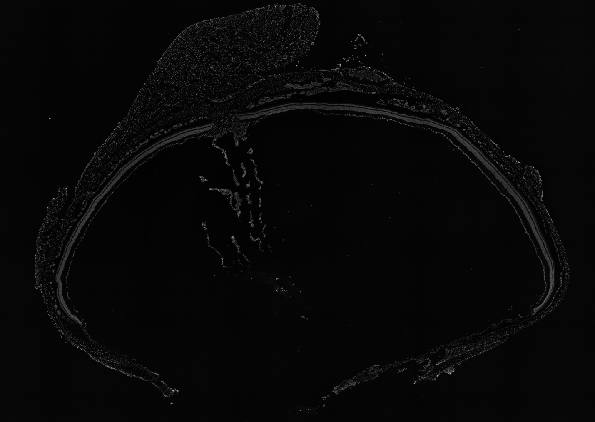
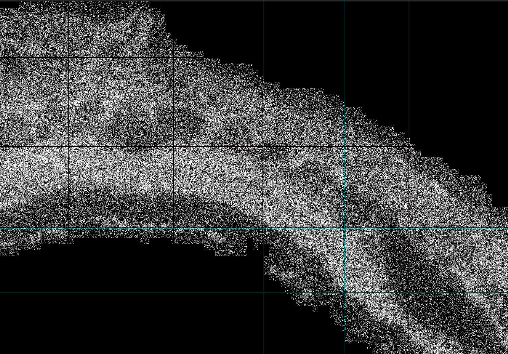
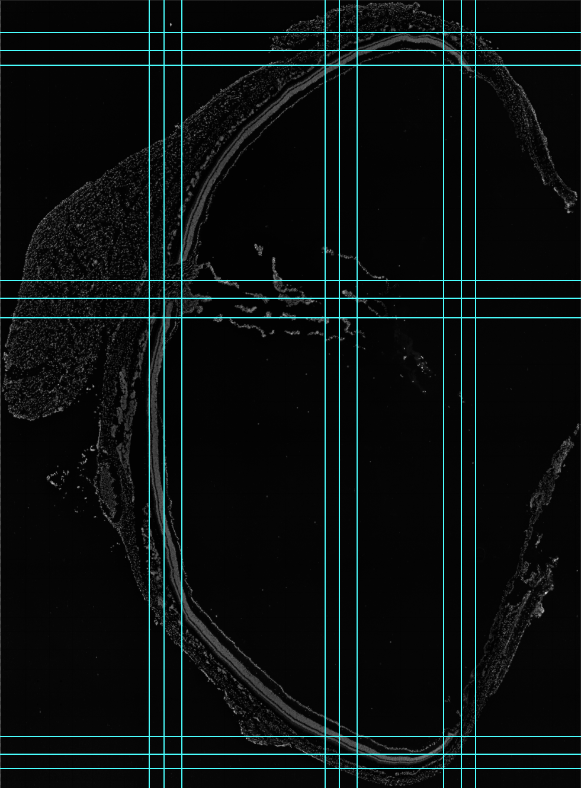

# Brief Instruction on Manual Registration

## 0. Before you start:
Please note that this tutorial is tailored for spatial omics data generated by **Stereo-seq Chip**, technology developed by **STOmics Tech**. The registration approach may differ somewhat when applied to data from other sequencning platforms. Please check important information and make adjustments to fit your own data and images.

## 1. General View
**Manual registration** is the process of mapping two or multiple images into a unified spatial framework by manually specifying corresponding points, boundaries or specific anatomical structures, when sometimes automatic registration methods are insufficient or require refinement. It is widely used in microscopic tissue sections and spatial transcriptome sections, etc.

## 2. Purpose of Registration
Two important results output by Stereo-seq and its analysis workflow (SAW) are a). `<SN>.tissue.gef` (gene expression file), the feature expression matrix under the tissue coverage region, which we later convert to `<SN>.tissue.gem` (gene expression matrix) that stores gene spatial expression data and it is further tranformed into a grayscale image `<SN>.mRNA.png` by script `1_Gem2Png`. b). `<SN>_ssDNA_regist_tif`, the panoramic image from staining layers, having been registered with the raw expression matrix. 

The `<SN>.mRNA.png` image converted from the gene expression matrix contains the authentic spatial information (coordinates) and expression data of all captured mRNA, which serves as a golden standard. While the `<SN>_ssDNA_regist_tif` image (automatically registered) reflects morphological and structural information of the tissue, and will be used to perform segmentation. However, these two images are usually mismatched, which means the spatial expression data are unable to aprropiately mapped into tissue regions, and both of them are essential for successful segmentation. In this case, manually registering the `<SN>_ssDNA_regist_tif` with `<SN>.mRNA.png` as a reference is necessary before segmentation step.

## 3. Image Preparation 

### 3.1 Input
- Image A: reference image (fixed, `<SN>.mRNA.png`)
- Image B: image to be registered (moving, `<SN>_ssDNA_regist_tif`)

### 3.2 Format
- `.tif`, `.png`, etc.

### 3.3 Tools
- Photo editors such as **Adobe Photoshop**.

## 4. Steps
**i**. Load the `<SN>.mRNA.png` image and adjust brightness / exposure to make the **Track lines** visible and clear. (Track lines are the crossing lines on a Stereo-seq chip between adjacent spots, regions where no mRNAs are captured.)

**ii**. Drag out rulers to align and anchor the reference track lines. (For accuracy, it it recommended that the rulers span two opposite corners of the tissue region.)

**iii**. Load the `<SN>_ssDNA_regist_tif` image, and roughly match the two graphs according to their relative locations on the panel. Common transforming methods inculde translation, rotation, mirroring, scaling, etc.

**iv**. Hide the reference image `<SN>.mRNA.png`, and then precisely register by slightly adjusting the position of `<SN>_ssDNA_regist_tif` until all the track lines of `<SN>_ssDNA_regist_tif` are approximately aligned. This way, the `<SN>_ssDNA_regist_tif` is successfully matched within a small margin of error.

**v**. Output the registered image.

## 5. Example (Presented with Pictures)

  
   
  <h3>Figure 1. The converted mRNA garyscale image containing spatial expression data</h3>

  
   
  <h3>Figure 2. The auto-registered ssDNA-staining tissue image (The original image is oversized so here is a clip)</h3>

  
   
  <h3>Figure 3. A zoom in of track lines on mRNA grayscale image</h3>

  
   
  <h3>Figure 4. The final registered ssDNA-staining image</h3>

  
   
  <h3>Figure 5. The output of registered image containing both spatial expression data and tissue structural information</h3>

